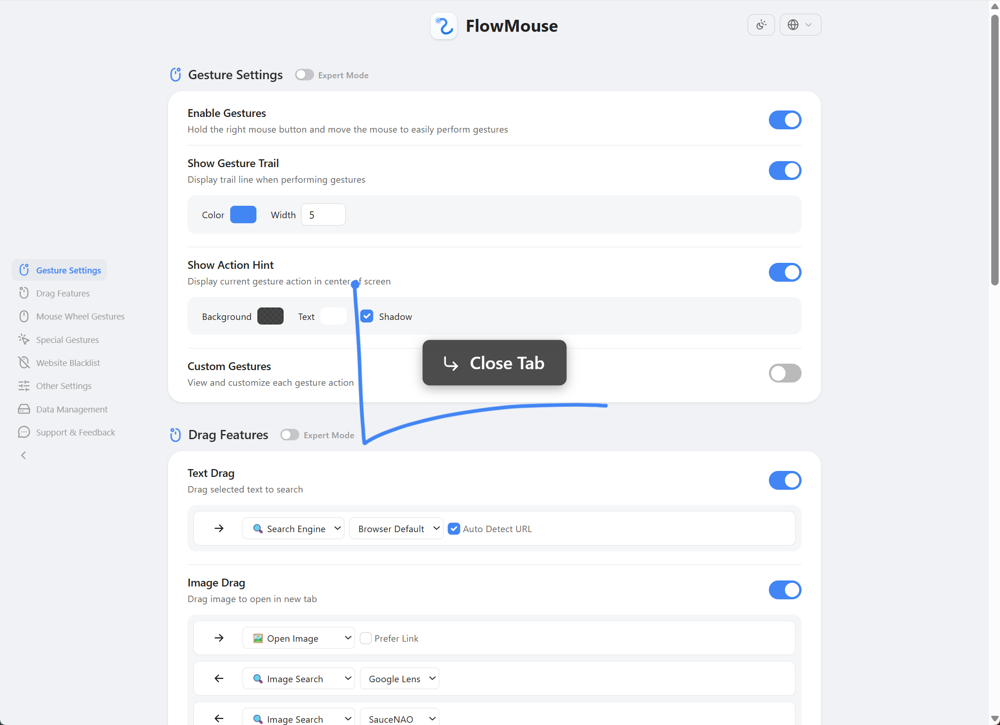

<b>English</b> · <a href="./README.zh_CN.md">中文</a>

<h1> FlowMouse</h1>

An open-source mouse gesture extension designed for ultimate smoothness. Swipe your fingertips, enter the *Flow*.

Supports gesture navigation, super drag, wheel and rocker gestures, and the ability to customize all gestures and more.

 

## Install

#### Chrome / Microsoft Edge

#### Firefox

> You can also download from [GitHub Releases](https://github.com/Hmily-LCG/FlowMouse/releases) for manual installation.

## Features

FlowMouse is a mouse gesture extension designed for ultimate smoothness. Seamlessly navigate your browser through natural mouse movements, helping you truly enter a focused and productive state of "flow".

-  **Custom gestures:** 16 built-in gestures, plus unlimited custom ones you define yourself.
-  **Super drag:** Drag text to search (custom engines supported), drag images to open/save/reverse-search, drag links to open/copy.
-  **Wheel gestures:** Hold the right mouse button and scroll to quickly switch tabs.
-  **Rocker gestures:** Hold one mouse button and click the other to navigate back/forward.
-  **Command chains:** Run multiple actions from a single gesture.
-  **Visual settings:** Configure gesture trail color, width, action hints, and more from a clean settings UI.
-  **Tutorial:** Interactive guide on first install.

## Default Gestures

All gestures can be customized in the options page.

| Gesture | Function | Gesture | Function |
|:---:|:---|:---:|:---|
| `←` | Back | `→` | Forward |
| `↑` | Scroll Up | `↓` | Scroll Down |
| `↑←` | Switch to Left Tab | `↑→` | Switch to Right Tab |
| `→↑` | New Tab | `→↓` | Reload Current Page |
| `↓←` | Stop Loading | `↓→` | Close Current Tab |
| `←↑` | Reopen Closed Tab | `←↓` | Close All Tabs |
| `↑↓` | Scroll to Bottom | `↓↑` | Scroll to Top |
| `←→` | Close Current Tab | `→←` | Reopen Closed Tab |

## Privacy

FlowMouse is an open source extension. The code is hosted on GitHub and open to review and contribution.

- FlowMouse **does not collect** any browsing history, bookmarks, or usage habits.
- FlowMouse **does not contain** any analytics or advertising code.
- FlowMouse **does not upload** any local data to third-party servers.

FlowMouse settings are stored locally via the browser's storage API. If browser sync is enabled (e.g., Chrome Sync, Firefox Sync), settings are encrypted and synced across your signed-in devices by the browser. This process is entirely controlled by your browser and follows your browser's privacy and sync settings.

## Changelog

See [CHANGELOG.md](https://github.com/Hmily-LCG/FlowMouse/blob/main/CHANGELOG.md).

## The story behind FlowMouse

For years, I was a loyal CrxMouse user. It genuinely improved my productivity. But one thing always bugged me: it kept requesting "advanced feature" permissions, which really meant access to my browsing history. I never agreed.

Then one day, a CrxMouse update broke things on the 52pojie forum: users couldn't log in, couldn't rate posts, and pages stopped redirecting after replying. I traced the issue to a JavaScript snippet injected by the extension. Other users reported the same problems, thinking the site itself was broken, but it was actually caused by the extension and affected all Discuz!-based forums.

I expected the author to fix it quickly. Two updates came and went, but the bug remained. After waiting over a month with no progress, I started looking for alternatives. There were very few similar extensions on the market, and none of them fully met my needs.

So I decided to build my own. That's how FlowMouse was born.

I still want to give credit to CrxMouse. It boosted my efficiency for years, and the problems it caused were the direct reason this project exists. I also want to thank Edge browser. Beyond the core gestures I use daily, FlowMouse's remaining gestures were modeled after Edge's built-in gesture set. I've always admired the smoothness and compatibility of Edge's native gestures; compared to drawing trails via JavaScript, native support is in a different league.

FlowMouse aims to carry on the convenience of gesture navigation while putting privacy and compatibility first. It's a small project born from a real need. If you've run into similar frustrations, maybe it can be a good alternative for you.

— Hmily [LCG]

---

**FlowMouse · Smoother browsing, effortless control.**

---

### Author Information
- **Authors**: Hmily [LCG] & Coxxs
- **Website**: [https://www.52pojie.cn/thread-2080303-1-1.html](https://www.52pojie.cn/thread-2080303-1-1.html)
- **GitHub**: [https://github.com/Hmily-LCG/FlowMouse](https://github.com/Hmily-LCG/FlowMouse)
- **Email**: Service@52pojie.cn
- Feedback and suggestions are welcomed via email.
