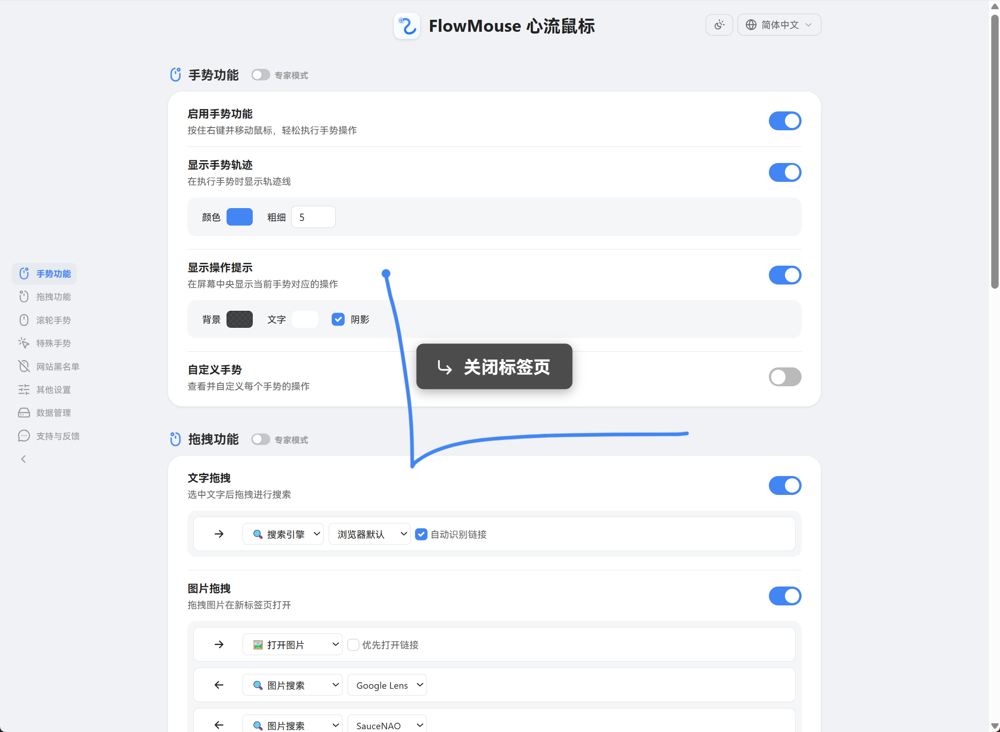

<a href="./README.md">English</a> · <b>中文</b>

<h1> FlowMouse 心流鼠标</h1>

一款追求极致流畅的开源鼠标手势扩展。指尖滑动，进入心流。

支持手势导航、超级拖拽、滚轮手势、特殊手势，并可自定义所有手势及更多功能。

 

## 安装

#### Chrome / Microsoft Edge

#### Firefox

> 也可从 [GitHub Releases](https://github.com/Hmily-LCG/FlowMouse/releases) 或 [百度网盘](https://pan.baidu.com/s/175cd1dOrAcQEAbRRFlOfhA?pwd=52pj) 下载并手动离线安装。

## 特性

FlowMouse 是一款追求极致流畅的鼠标手势扩展。通过自然的鼠标滑动，助您无缝操控浏览器，真正进入专注高效的“心流”状态。

-  **自定义手势** - 内置 16 种默认手势，支持自定义扩展更多手势操作。
-  **超级拖拽** - 拖拽文字进行搜索（支持自定义引擎），拖拽图片查看/保存/以图搜索，拖拽链接打开/复制。
-  **滚轮手势** - 按住鼠标右键并滚动滚轮，快速切换标签页。
-  **特殊手势** - 按住一个鼠标按键的同时点击另一个按键，实现后退/前进导航。
-  **命令链** - 通过单个手势连续执行多个操作。
-  **可视化设置** - 提供清晰的设置界面，支持自定义手势轨迹颜色、宽度及操作提示。
-  **新手引导** - 首次安装提供交互式的新手入门教程。

## 默认手势

所有手势均可在选项页面修改或自定义。

| 手势 | 功能 | 手势 | 功能 |
|:---:|:---|:---:|:---|
| `←` | 后退 | `→` | 前进 |
| `↑` | 向上滚动 | `↓` | 向下滚动 |
| `↑←` | 切换到左侧标签页 | `↑→` | 切换到右侧标签页 |
| `→↑` | 新建标签页 | `→↓` | 刷新当前页面 |
| `↓←` | 停止加载 | `↓→` | 关闭当前标签页 |
| `←↑` | 恢复关闭的标签页 | `←↓` | 关闭所有标签页 |
| `↑↓` | 滚动到底部 | `↓↑` | 滚动到顶部 |
| `←→` | 关闭当前标签页 | `→←` | 恢复关闭的标签页 |

## 隐私

FlowMouse 是开源项目，代码已托管于 GitHub，欢迎审阅与贡献。

- FlowMouse **不收集**任何您的浏览历史、书签或操作习惯。
- FlowMouse **不包含**任何数据分析或广告代码。
- FlowMouse **不上传**任何本地数据至第三方服务器。

您的设置通过浏览器的存储 API 保存在本地。若启用了浏览器同步服务（如 Chrome Sync、Firefox Sync），设置将由浏览器内置的同步服务在您已登录的设备间加密同步。该过程完全由浏览器控制，并遵循浏览器的隐私与同步设置。

## 更新日志

详见 [CHANGELOG.zh_CN.md](https://github.com/Hmily-LCG/FlowMouse/blob/main/CHANGELOG.zh_CN.md)。

## 缘起

多年以来，我一直是 CrxMouse 的忠实用户，它确实极大地提升了我的操作效率。然而，长期使用中也一直伴随着一个困扰：它频繁弹出请求授予“高级功能”权限——实质上是希望获取用户访问的网址记录。出于对隐私的坚持，我始终没有同意。

直到几个月前，CrxMouse 的一次版本更新导致我在访问吾爱破解论坛时，发现了异常：用户无法登陆、不能评分，甚至回帖后页面也不再自动跳转。经过排查，我很快确认问题根源在于该扩展程序注入的 JavaScript 脚本。论坛里也陆续出现了大量用户反馈，他们遇到了同样的困扰，以为是网站本身出了问题，其实是插件兼容性导致的，并且这个问题影响所有 Discuz! 论坛。

我本期待插件作者能尽快修复。可惜事与愿违，尽管接连发布了两个更新，问题依然存在。在等待一个多月仍无进展后，我意识到可能需要寻找替代方案。然而市场上同类扩展程序寥寥无几，功能也难以完全符合需求。

于是，我决定自己动手。就这样，FlowMouse 诞生了。

在此，我依然想感谢 CrxMouse，它不仅多年来为我带来了效率提升，也正是因为它所暴露的问题，直接促成了这个新扩展程序的开发。同时，也要感谢 Edge 浏览器，除了我常用的几个核心手势外，FlowMouse 中其余的手势功能也参考了 Edge 的常用手势进行了补全。一直很羡慕 Edge 原生手势的流畅性能与出色兼容性，毕竟相比通过 JavaScript 绘制轨迹，原生支持的效果确实要好太多。

FlowMouse 希望能延续手势操作的便捷，同时更注重隐私保护与稳定兼容。这是一个源于实际需求、也回归用户体验的小项目。如果你也遇到类似困扰，或许它能为你提供一个新的选择。

— Hmily [LCG]

---

**FlowMouse · 让浏览更流畅，让操作更随心。**

---

### 作者信息
- **作者**：Hmily [LCG] & Coxxs
- **官网**：[https://www.52pojie.cn/thread-2080303-1-1.html](https://www.52pojie.cn/thread-2080303-1-1.html)
- **GitHub**：[https://github.com/Hmily-LCG/FlowMouse](https://github.com/Hmily-LCG/FlowMouse)
- **邮箱**：Service@52pojie.cn
- 欢迎大家通过邮箱反馈问题和改进建议。
